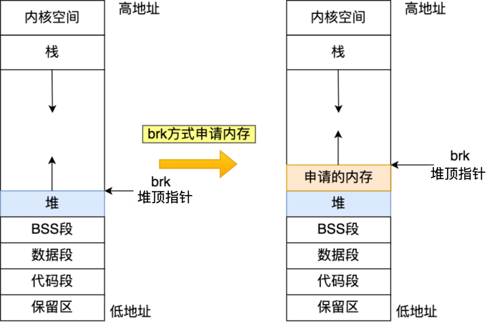

# 指针常量和常量指针

## 常量指针（底层const）

常量指针是指向常量的指针，这意味着通过这个指针不能修改它所指向的值。指针本身是可以改变的，但它指向的数据是常量。

```c++
int value = 5;
const int* ptr = &value;
*ptr = 10; // 错误：不能通过指针修改数据
value = 10; // 这是允许的，数据本身不是常量
int anotherValue = 20;
ptr = &anotherValue; // 这是允许的，指针本身可以改变
```

## 指针常量（顶层const）

指针常量是修饰指针的常量，这意味着这个指针在初始化后不能再指向其他地址，但它指向的数据是可以修改的。

```c++
int value = 5;
int* const ptr = &value;
*ptr = 10; // 这是允许的，可以通过指针修改数据
int anotherValue = 20;
ptr = &anotherValue; // 错误：不能改变指针本身的值
```

# 指针数组和数组指针

## 指针数组（Array of Pointers）

指针数组是一个数组，数组的每个元素都是指针。

```cpp
int a = 1, b = 2, c = 3;
int* arr[3]; // 声明一个包含 3 个 int* 指针的数组

arr[0] = &a;
arr[1] = &b;
arr[2] = &c;

for (int i = 0; i < 3; ++i) {
    printf("%d\n", *arr[i]); // 输出 1 2 3
}
```

## 数组指针（Pointer to an Array）

数组指针是一个指向数组的指针。

```cpp
int arr[10]; // 声明一个包含 10 个 int 的数组
for (int i = 0; i < 10; ++i) {
    arr[i] = i;
}

int (*ptr)[10] = &arr; // 声明一个指向该数组的指针

// 访问数组中的元素
for (int i = 0; i < 10; ++i) {
    printf("%d\n", (*ptr)[i]); // 输出 0 1 2 3 4 5 6 7 8 9
}
```


# Windows下和Linux下，C++的区别，或者编译的区别

Windows 和 Linux 下 C++ 编程及编译存在一些差异，这些差异主要体现在系统调用、编译工具链、库和文件系统等方面。以下是详细的对比：

## 1. 编译工具链

**Windows**:

- 常用编译器：Microsoft Visual C++ (MSVC)，MinGW（Minimalist GNU for Windows），Cygwin。
- 集成开发环境（IDE）：Visual Studio 是最常用的 IDE，支持 MSVC 编译器并提供丰富的开发工具和调试功能。

**Linux**:

- 常用编译器：GNU Compiler Collection (GCC)，Clang。
- 集成开发环境（IDE）：常用的 IDE 包括 Eclipse CDT，CLion，KDevelop，但很多开发者使用文本编辑器（如 Vim、Emacs）和命令行工具（如 make、cmake）进行开发。

## 2. 系统调用和API

**Windows**:

- 使用 WinAPI 进行系统级编程，如文件操作、进程管理、线程控制、网络通信等。
- 需要链接 Windows 特有的库，如 `kernel32.lib`, `user32.lib`, `gdi32.lib`。

**Linux**:

- 使用 POSIX 标准 API 进行系统级编程，如文件操作、进程管理、线程控制、网络通信等。
- 常用的库包括 `libc`, `libpthread`, `libm`, `libdl` 等。

## 3. 文件系统和路径

**Windows**:

- 文件路径使用反斜杠 `\` 作为分隔符，例如：`C:\Program Files\MyApp`。
- 文件路径不区分大小写。

**Linux**:

- 文件路径使用斜杠 `/` 作为分隔符，例如：`/home/user/myapp`。
- 文件路径区分大小写。

## 4. 动态链接库

**Windows**:

- 动态链接库使用 `.dll` 后缀。
- 链接动态库时，使用 `import` 库（`.lib` 文件）。

**Linux**:

- 动态链接库使用 `.so` 后缀。
- 链接动态库时，使用 `-l` 选项指定库名，例如 `-lm` 链接 `libm.so`。

## 5. 编译命令和脚本

**Windows**:

- 使用 MSVC 时，通过 `cl` 命令编译源文件，例如：`cl /EHsc main.cpp`。
- 使用 MinGW 时，通过 `g++` 命令编译源文件，例如：`g++ main.cpp -o main.exe`。

**Linux**:

- 使用 GCC 时，通过 `g++` 命令编译源文件，例如：`g++ main.cpp -o main`。

## 6. 代码风格和惯例

**Windows**:

- 通常使用 Windows 特有的代码风格和习惯，例如使用 Windows 消息循环，窗口处理等。
- 可能需要处理 Windows 特有的宏定义和预处理指令，例如 `_WIN32`, `_WINDOWS`。

**Linux**:

- 通常使用 POSIX 标准代码风格和惯例，例如使用 `fork` 创建进程，使用 `pthread` 进行线程控制。
- 可能需要处理 Linux 特有的宏定义和预处理指令，例如 `_GNU_SOURCE`。

## 7. 其他差异

**Windows**:

- Visual Studio 提供了强大的开发和调试工具，但生成的项目文件（如 `.sln`, `.vcxproj`）只能在 Windows 上使用。
- 对于跨平台开发，可能需要额外的工具和库，如 CMake、Qt 等。

**Linux**:

- 常用 `make` 和 `cmake` 进行项目管理和构建，`makefile` 和 `CMakeLists.txt` 通常是跨平台的。
- 对于跨平台开发，CMake 是常用的工具，可以生成适用于不同平台的项目文件。

**总结**

总的来说，Windows 和 Linux 下的 C++ 编程和编译存在一些差异，但通过使用跨平台的库和工具（如 Boost、Qt、CMake），可以最大程度地减少这些差异，编写出可移植性更强的代码。在实际开发中，根据项目需求选择合适的工具链和开发环境至关重要。

# C++三大特性理解

在 C++ 中，通常提到的三大特性是指：封装（Encapsulation）、继承（Inheritance）、多态（Polymorphism）。这些特性是面向对象编程（Object-Oriented Programming, OOP）的基础，以下是对它们的简要理解：

## 1. 封装（Encapsulation）

封装是将数据（属性）和操作（方法或函数）封装在一个单元（类）中，并保护数据不受外部直接访问，而是通过公共的方法（接口）来访问和操作数据。封装的关键是将数据和操作封装在一起，隐藏实现细节，提供简单的接口给外部使用者。通过封装，可以实现以下目标：

- **数据隐藏和访问控制**：类可以控制成员变量的访问权限（公有、私有、保护），避免直接操作数据，从而提高代码安全性和可维护性。
- **接口定义**：通过公共方法（成员函数）定义类的操作接口，简化使用者对类的操作，同时可以灵活调整实现细节。

## 2. 继承（Inheritance）

继承允许一个类（派生类）从另一个类（基类）派生，从而获得基类的属性和方法。派生类可以扩展或修改基类的行为，实现代码的重用和扩展。主要特点包括：

- **代码重用**：派生类可以重用基类的成员函数和数据成员，减少重复代码，提高代码的可维护性和可扩展性。
- **继承层次**：通过多层次的继承，可以形成类的层次结构，更好地组织和管理代码。
- **多态性支持**：通过虚函数和动态绑定实现多态性，允许派生类重写基类的虚函数，提供不同的实现。

## 3. 多态（Polymorphism）

多态性允许以统一的方式使用不同类的对象，通过基类的指针或引用调用派生类的方法，实现运行时绑定。主要表现在：

- **静态多态性（编译期多态）**：函数重载和运算符重载，允许多个同名函数或运算符在同一作用域内定义，通过参数列表或操作数的类型区分调用。
- **动态多态性（运行时多态）**：通过虚函数和虚函数表实现，允许基类指针或引用调用派生类的同名虚函数，并根据对象的实际类型确定调用哪个函数。

**总结**

- **封装**提供了数据隐藏和接口定义的能力，增强了代码的安全性和可维护性。
- **继承**通过类之间的层次结构实现了代码的重用和扩展。
- **多态**允许以统一的方式操作不同类型的对象，提高了代码的灵活性和可扩展性。

这些特性共同构成了面向对象编程的基础，使得代码更加模块化、可复用和易于维护。

# C和C++如何分配堆内存?new和malloc的区别?malloc的原理?

在C和C++中，堆内存的分配方法有所不同，主要体现在C++引入了`new`和`delete`操作符，而C使用`malloc`、`calloc`和`free`函数。以下是详细说明：

## C中的堆内存分配

### `malloc`函数

- **语法**: `void* malloc(size_t size);`

- **功能**: 分配`size`字节的连续内存块，返回指向该内存块的指针。返回的内存未初始化。

- 示例

  ```c
  int* ptr = (int*)malloc(10 * sizeof(int));
  if (ptr == NULL) {
      // 内存分配失败
  }
  ```

### `calloc`函数

- **语法**: `void* calloc(size_t num, size_t size);`

- **功能**: 分配`num`个大小为`size`字节的连续内存块，并将分配的内存全部初始化为0。

- 示例

  ```c
  int* ptr = (int*)calloc(10, sizeof(int));
  if (ptr == NULL) {
      // 内存分配失败
  }
  ```

### `free`函数

- **语法**: `void free(void* ptr);`

- **功能**: 释放之前由`malloc`、`calloc`或`realloc`分配的内存。

- 示例

  ```c
  free(ptr);
  ```

## C++中的堆内存分配

### `new`和`delete`操作符

- 语法

  ```cpp
  // 分配单个对象
  Type* ptr = new Type;
  // 分配数组
  Type* ptr = new Type[num];
  // 释放单个对象
  delete ptr;
  // 释放数组
  delete[] ptr;
  ```

- 功能

  - `new`：分配内存并调用构造函数进行初始化。
  - `delete`：释放内存并调用析构函数进行清理。

- 示例

  ```cpp
  int* ptr = new int(5); // 分配并初始化为5
  int* arr = new int[10]; // 分配数组
  delete ptr; // 释放单个对象
  delete[] arr; // 释放数组
  ```

### `new`和`malloc`的区别

1. **类型安全**:
   - `new`返回的是具体类型的指针，无需进行类型转换。
   - `malloc`返回`void*`，需要进行显式类型转换。
2. **初始化**:
   - `new`会调用构造函数进行初始化。
   - `malloc`只分配内存，不进行初始化。
3. **配对使用**:
   - `new`分配的内存必须用`delete`释放，`new[]`分配的数组必须用`delete[]`释放。
   - `malloc`分配的内存必须用`free`释放。
4. **失败处理**:
   - `new`分配失败时会抛出`std::bad_alloc`异常。
   - `malloc`分配失败时返回`NULL`。

### `malloc`的原理

`malloc`的实现依赖于操作系统提供的底层内存分配接口，常见的包括`brk`/`sbrk`和`mmap`。以下是`malloc`的简要工作原理：

1. **初始化**:
   - 在程序启动时，分配一块初始的堆内存区域，通常通过`brk`/`sbrk`系统调用扩展进程的数据段。
2. **内存池管理**:
   - `malloc`维护一个空闲块链表（free list），用于管理已经分配但未使用的内存块。
   - 当请求内存时，`malloc`在空闲链表中查找合适的块进行分配。如果找到合适的块，则将其从链表中移除并返回给用户。
3. **内存扩展**:
   - 如果空闲链表中没有合适的块，`malloc`会通过`brk`/`sbrk`或`mmap`向操作系统请求更多的内存，并将其添加到空闲链表中。
4. **合并与拆分**:
   - 当用户释放内存时，`free`将内存块插入空闲链表中。
   - `malloc`和`free`会合并相邻的空闲块，以减少内存碎片。
   - `malloc`会将大块拆分成小块，以满足不同大小的内存请求。

### **关于brk，mmap**

实际上，malloc() 并不是系统调用，而是 C 库里的函数，用于动态分配内存。malloc 申请内存的时候，会有两种方式向操作系统申请堆内存。

- 方式一：通过 brk() 系统调用从堆分配内存
- 方式二：通过 mmap() 系统调用在文件映射区域分配内存；

方式一实现的方式很简单，就是通过 brk() 函数将「堆顶」指针向高地址移动，获得新的内存空间。如下图：



方式二通过 mmap() 系统调用中「私有匿名映射」的方式，在文件映射区分配一块内存，也就是从文件映射区“偷”了一块内存。如下图：


# C++ 如何让类对象只在堆或栈上创建

## **只能在堆上创建对象**

在C++中，类的创建分为两种。一种是静态创建，即直接创建对象；另一种是动态创建对象，即通过 new 创建，如 T *t = new T。要想正确回答上题，就必须知道这两种创建方式的区别。

**1 静态创建**

由编译器在栈中为对象分配内存，通过移动栈顶指针获得合适大小的空间，然后调用对象的构造函数生成对象。

**2 动态创建**

通过new在堆中创建对象。这个过程分为两步：首先在堆中找到合适大小的空间并分配，然后调用对象的构造函数生成对象。


因为两者都需要调用对象的构造函数，所以通过将构造函数私有化的做法是行不通的。那么还有其他办法吗？这是就需要了解静态创建的另一个特点了。

编译器在为类对象分配栈空间时，会先检查类的析构函数的访问性，其实不光是析构函数，只要是非静态的函数，编译器都会进行检查。如果类的析构函数是私有的，则编译器不会在栈空间上为类对象分配内存。
所以我们只需要将析构函数私有化就可以组织直接创建对象了。由于栈的创建和释放都需要由系统完成的，所以若是无法调用构造或者析构函数，自然会报错。

当然为了我们能够正确释放动态创建的对象，我们必须提供一个公有函数，该函数的唯一功能就是删除对象本身。

 测试代码如下：

```cpp
#include<iostream>
using namespace std;
class test
{
private:
	~test(){ cout << "test destroy" << endl; }
public:
	void destroy()
	{
		delete this;
	}
};
int main()
{
	//test p;//编译器报错test::~test()不可访问
	test *p = new test;
	p->destroy();
}
```

## **只能在栈上创建对象**

既然可以做到只在堆上创建对象，同样的我们可以只在栈上创建对象。
其实理解了这个理念，不难想到我们只需要 让new操作符无法使用即可，要做到这件事，我们可以将 new操作符重载并设置为私有访问即可。是不是很巧妙的方法~
重载new的同时最好重载delete

```cpp
#include<iostream>
using namespace std;
class test
{
private:
	void* operator new(size_t t){}
	void operator delete(void* ptr){}
public:
	~test()
	{
		cout << "test destroy" << endl;
	}
};
int main()
{
	//test *A = new test;
	//编译器报错函数test::operator new 不可访问
	test A;
}
```


# vector存储大量数据

## 1. 预留空间

在插入大量数据之前，通过 `reserve` 方法预留足够的空间。这样做有两个主要好处：

- **减少内存重新分配次数**：默认情况下，当 `std::vector` 的容量不足时，会自动扩展容量。每次扩展都可能导致内存重新分配和复制元素，耗费时间。通过 `reserve` 预留空间，可以减少这些内存重新分配的次数，提升性能。
- **改善内存连续性**：预留空间可以让 `std::vector` 的元素在内存中分配连续的空间，有利于CPU缓存命中率，进而提高访问速度。

```cpp
const int SIZE = 1000000;
std::vector<int> vec;
vec.reserve(SIZE);  // 预留空间以存放百万级数据
```

## 2. 使用移动语义

当需要将临时对象或者函数返回的 `std::vector` 对象添加到另一个 `std::vector` 中时，可以使用移动语义 `std::move`。移动语义避免了不必要的拷贝操作，提高了插入和赋值的效率。

```cpp
std::vector<int> tempVec;
// 填充 tempVec

// 将 tempVec 移动到 vec 中
vec.insert(vec.end(), std::make_move_iterator(tempVec.begin()), std::make_move_iterator(tempVec.end()));
```

## 3. 使用emplace_back和emplace

对于需要构造对象并插入到 `std::vector` 的情况，可以使用 `emplace_back` 和 `emplace`，这些函数直接在 `std::vector` 的末尾构造对象，避免了额外的拷贝或移动操作。

```cpp
struct MyStruct {
    int a;
    double b;
    MyStruct(int a_, double b_) : a(a_), b(b_) {}
};

std::vector<MyStruct> vec;
// 使用 emplace_back 添加新元素
vec.emplace_back(1, 3.14);
```

## 4. 避免频繁的插入和删除

`std::vector` 在中间位置进行插入或删除操作时，会导致后续元素的移动，性能较差。如果需要频繁的插入和删除操作，考虑使用 `std::deque` 或 `std::list` 等数据结构，它们在特定操作上可能更高效。

# push_back和emplace_back

`push_back` 和 `emplace_back` 都是用于向 `std::vector` 中添加新元素的成员函数，它们有一些区别，主要体现在元素的构造方式和性能上。

## push_back

- **作用**：将一个已经构造好的元素拷贝或移动到 `std::vector` 的末尾。
- **语法**：`void push_back(const T& value);` 或 `void push_back(T&& value);`
- **用途**：适用于已经有元素的情况，或者希望通过拷贝或移动现有对象来添加新元素。

```cpp
std::vector<int> vec;
int x = 10;
vec.push_back(x); // 拷贝 x 到 vector 的末尾
vec.push_back(20); // 移动临时创建的对象到 vector 的末尾
```

## emplace_back

- **作用**：在 `std::vector` 的末尾就地构造一个新元素。
- **语法**：`template <class... Args> void emplace_back(Args&&... args);`
- **用途**：适用于直接在 `std::vector` 末尾构造新对象，避免了多余的拷贝或移动操作，因此在性能上可能更高效。

```cpp
struct Person {
    std::string name;
    int age;
    Person(std::string n, int a) : name(std::move(n)), age(a) {}
};

std::vector<Person> people;
people.emplace_back("Alice", 30); // 在 vector 末尾就地构造 Person 对象
```

## 区别总结：

- **构造方式**：
  - `push_back`：通过拷贝或移动已有对象添加新元素。
  - `emplace_back`：在容器末尾就地构造一个新元素，避免了额外的拷贝或移动。
- **性能比较**：
  - `emplace_back` 在构造新对象时可能比 `push_back` 更高效，因为它避免了一次额外的拷贝或移动操作。
- **使用场景**：
  - 如果已有元素或直接可以构造新元素时，可以使用 `push_back`。
  - 如果需要构造新的元素并且希望在性能上有所优化，则推荐使用 `emplace_back`。

# C++动态绑定实现方式

在C++中，动态绑定是通过虚函数（virtual function）和虚函数表（vtable）来实现的。动态绑定允许在运行时根据对象的实际类型来调用相应的函数。

## 实现原理

1. **虚函数**：在基类中使用 `virtual` 关键字声明的成员函数称为虚函数。虚函数使得在基类中定义的函数可以在派生类中被重写（覆盖）。

   ```cpp
   class Base {
   public:
       virtual void func() {
           // Base 类中的默认实现
       }
   };
   ```

2. **虚函数表（vtable）**：每个包含虚函数的类都会有一个对应的虚函数表，用于存储这些虚函数的地址。每个对象都有一个指向其类的虚函数表的指针（或者称为虚指针）。

   - 虚函数表是编译器在编译时自动生成的静态数据结构。
   - 虚函数表中存储了虚函数的地址，每个虚函数在表中的位置是确定的，通过这个表可以动态地找到对象的实际函数。

3. **动态绑定过程**：

   - 当通过基类指针或引用调用虚函数时，编译器会使用对象的虚指针找到其对应的虚函数表。
   - 然后根据函数在虚函数表中的索引找到实际被调用的函数地址。
   - 这个过程保证了即使通过基类指针或引用调用虚函数，实际执行的是对象的派生类中的函数（如果有重写的话）。

# extern C的作用，为什么要用extern C

`extern "C"` 是一个用于告诉 C++ 编译器按照 C 语言的方式对待某段代码的指令。主要作用是为了在 C++ 中使用 C 语言编写的代码或库时，保证其在链接过程中能够正确链接，并且能够正确处理函数名的名称修饰（Name Mangling）。

## 为什么要用 `extern "C"`？

1. **函数名称修饰（Name Mangling）**：
   - C++ 编译器会对函数的名称进行修饰，以便支持函数的重载、命名空间等特性。修饰的方法与编译器有关，通常包括函数名、参数类型、参数个数等信息。例如，一个名为 `func` 的函数在编译后可能会变成 `_Z4funcv`。这种名称修饰在 C 语言中是不存在的，因此在 C++ 中调用 C 语言编写的函数时，需要告诉编译器使用 C 语言的名称而不是修饰过的名称。
2. **链接兼容性**：
   - C++ 和 C 的函数调用约定有所不同，包括函数参数的传递方式、函数调用堆栈的处理等。使用 `extern "C"` 可以确保 C++ 能够正确地链接和调用 C 函数，避免因为函数调用约定不同导致的链接错误或运行时错误。
3. **混合语言开发**：
   - 在实际项目中，可能会使用 C++ 编写的代码与 C 语言编写的库进行交互。为了确保两者能够无缝集成，需要使用 `extern "C"` 来声明 C 语言风格的接口，以保证编译器按照 C 的规则处理这些接口。

下面是一个简单的示例，展示了如何使用 `extern "C"`：

```cpp
// C 库的头文件 example.h
#ifdef __cplusplus
extern "C" {
#endif

void c_function(); // 声明一个 C 风格的函数

#ifdef __cplusplus
}
#endif
```

在上述示例中：

- `#ifdef __cplusplus` 和 `#endif` 用于判断当前是否在 C++ 环境下，如果是，则将 `extern "C"` 包裹的部分声明为 C 风格。
- `void c_function();` 是一个声明了 C 风格的函数原型，这样在 C++ 中引入头文件时，编译器能够正确识别并使用这个函数。

总结来说，`extern "C"` 主要用于保证 C++ 与 C 之间的接口能够正确链接和调用，是在混合语言开发中非常重要的一种技术手段。

# C++关键字

## inline

`inline` 是 C++ 中的一个关键字，用于对函数进行标记，告诉编译器在调用处将函数体内容直接展开，而不是通过函数调用的方式进行调用。其主要作用如下：

1. **函数体展开**：
   - 当函数被声明为 `inline` 时，编译器会尝试在每个调用点将函数体直接插入到调用处，而不是通过函数调用的方式执行。这样可以减少函数调用的开销，特别是对于短小的函数体来说，这种方式可以提高程序的执行效率。
2. **避免函数调用开销**：
   - 函数调用涉及到压栈、传参、跳转等操作，尤其是在频繁调用的情况下会增加额外的开销。使用 `inline` 可以避免这些开销，因为函数体直接嵌入到调用处。
3. **头文件中的定义**：
   - 当函数在头文件中定义时，通常应该将其声明为 `inline`，以避免在多个编译单元中重复定义引起的链接错误。这种情况下，编译器会将函数的定义放在每个引用处，避免多重定义。
4. **编译器优化**：
   - `inline` 也可以被视为一种编译器优化的提示。编译器可以根据情况选择是否将函数展开，它并不一定会完全按照 `inline` 的要求进行处理。通常，对于复杂的函数或者递归函数，编译器可能会忽略 `inline` 的请求。
5. **注意事项**：
   - 使用 `inline` 应该注意函数的规模和复杂性，过大或者过于复杂的函数体不适合使用 `inline`。
   - `inline` 函数定义通常放在头文件中，以便让编译器能够在每个使用处进行展开。
   - 在类中定义的成员函数，默认情况下是隐式地 `inline`。

```cpp
// 在声明处定义为 inline
inline int add(int a, int b) {
    return a + b;
}

int main() {
    int result = add(3, 4); // 编译器会将 add 函数展开直接执行
    return 0;
}
```

总结来说，`inline` 的主要作用是优化函数调用，减少函数调用带来的开销，并且可以提高程序的执行效率，特别是在短小函数的场景下。

## extern

`extern` 是 C++ 中的一个关键字，用于声明外部变量或函数，表示这些变量或函数是在其他文件中定义的。它的主要作用是告诉编译器某个变量或函数的定义在当前文件之外，需要在链接时找到其定义。

**使用场景和作用**

1. **声明外部变量**：

   - 当一个变量在多个文件中使用时，可以使用 `extern` 在其他文件中声明它，避免重复定义。
   - 通常情况下，`extern` 声明位于头文件中，定义则在对应的源文件中。

   ```cpp
   // 在头文件中声明 extern 变量
   extern int global_var;
   
   // 在源文件中定义全局变量
   int global_var = 100;
   ```

2. **声明外部函数**：

   - 如果一个函数在某个文件中定义，在其他文件中需要使用它，可以使用 `extern` 声明函数原型。
   - 这样做可以让编译器知道该函数的返回类型和参数列表，而不需要了解函数的具体实现。

   ```cpp
   // 在头文件中声明 extern 函数原型
   extern void some_function(int arg);
   
   // 在源文件中定义函数
   void some_function(int arg) {
       // 函数实现
   }
   ```

3. **链接外部符号**：

   - 当编译器在处理某个文件时遇到 `extern` 声明的变量或函数时，它会在链接阶段查找实际的定义。
   - 这使得不同源文件之间可以共享全局变量和函数，有助于模块化和组织代码。

4. **多文件编程**：

   - 在大型项目中，通常会将程序分为多个源文件，每个文件包含特定的函数或变量定义。使用 `extern` 可以帮助组织这些文件，并确保它们之间正确地链接和使用。

5. **注意事项**：

   - `extern` 关键字本身并不会创建变量或函数，它只是告诉编译器该符号在其他地方有定义。
   - 在 C++ 中，全局变量默认情况下就是 `extern` 的，因此在其他文件中可以直接使用 `extern` 也可以省略不写。

```cpp
// 示例：使用 extern 声明全局变量和函数
// header.h
#ifndef HEADER_H
#define HEADER_H

// 声明全局变量
extern int global_var;

// 声明函数原型
extern void some_function(int arg);

#endif

// source.cpp
#include "header.h"

// 定义全局变量
int global_var = 100;

// 定义函数
void some_function(int arg) {
    // 函数实现
}

// other_source.cpp
#include "header.h"

// 使用全局变量和函数
int main() {
    some_function(global_var);
    return 0;
}
```

在这个示例中，`header.h` 中的 `extern` 声明了全局变量 `global_var` 和函数 `some_function`，然后在 `source.cpp` 中定义了它们的实际内容，而 `other_source.cpp` 可以通过包含头文件来使用这些变量和函数。

# C++从代码到可执行文件

将C++代码从源代码转换为可执行文件（exe）的过程涉及多个步骤。以下是这些步骤的详细解释：

## 1. 编写源代码

首先，开发者编写C++源代码文件，通常扩展名为`.cpp`。例如，假设有一个文件`main.cpp`：

```cpp
#include <iostream>

int main() {
    std::cout << "Hello, World!" << std::endl;
    return 0;
}
```

## 2. 预处理

预处理阶段由预处理器完成，预处理器会处理所有以`#`开头的指令，如`#include`、`#define`等。预处理器会展开宏，包含头文件等。这一步的输出是一个纯C++代码的中间文件。

命令：

```sh
g++ -E main.cpp -o main.i
```

## 3. 编译

编译器将预处理后的代码翻译成汇编代码。这个阶段会进行语法检查和优化，但不生成机器码。输出是一个汇编文件，通常扩展名为`.s`。

命令：

```sh
g++ -S main.i -o main.s
```

## 4. 汇编

汇编器将汇编代码转换成机器码，生成目标文件（object file）。目标文件包含了机器指令，但还不是一个完整的可执行文件。目标文件的扩展名通常为`.o`或`.obj`。

命令：

```sh
g++ -c main.s -o main.o
```

## 5. 链接

链接器将一个或多个目标文件与所需的库文件链接起来，生成最终的可执行文件。链接器负责解析所有的符号（例如函数和变量）并将它们连接在一起，生成一个完整的可执行文件。

命令：

```sh
g++ main.o -o main
```

## 总结

完整的命令流程：

```sh
g++ -E main.cpp -o main.i
g++ -S main.i -o main.s
g++ -c main.s -o main.o
g++ main.o -o main
```

通常我们会使用一个命令来完成上述所有步骤：

```sh
g++ main.cpp -o main
```

这个命令会调用预处理器、编译器、汇编器和链接器，最终生成一个名为`main`的可执行文件。

## 各阶段的角色

1. **预处理器**：
   - 处理预处理指令，包含头文件，展开宏定义等。
2. **编译器**：
   - 语法检查，将高层次语言翻译成汇编语言，进行代码优化。
3. **汇编器**：
   - 将汇编代码转换为机器码，生成目标文件。
4. **链接器**：
   - 将各个目标文件和库文件链接起来，解决符号依赖，生成最终的可执行文件。

## 常见问题

- **编译错误**：通常是因为语法错误、类型错误、未定义的符号等。
- **链接错误**：通常是因为未定义的符号，未找到的库等。
- **运行时错误**：通常是因为逻辑错误、内存泄漏等。

通过上述步骤，C++源代码可以被转换为可执行文件，并在目标平台上运行。每个步骤都有其特定的任务和输出，通过这些步骤的协调工作，最终实现从源代码到可执行文件的转换。

# 动态链接与静态链接

**静态链接（Static Linking）**：在编译链接过程中，将所有需要的库和目标文件都链接到一起，生成一个独立的可执行文件。所有的库函数和其他模块的代码在编译时被复制到最终的可执行文件中。

**动态链接（Dynamic Linking）**：在运行时将所需的库加载到内存中，程序运行时才解析这些库函数的地址。可执行文件并不包含库代码，而是在运行时由操作系统动态加载库。

## 静态链接的优缺点

**优点**：

1. **独立性**：生成的可执行文件是自包含的，运行时不依赖外部的库文件，因此在部署和分发时非常方便。
2. **加载速度快**：由于所有代码都已经在可执行文件中，加载和启动速度较快。
3. **版本控制**：避免了动态库版本的不一致问题，每个可执行文件都使用了编译时的库版本。

**缺点**：

1. **文件体积大**：由于所有的库代码都包含在可执行文件中，生成的可执行文件较大。
2. **内存占用大**：多个使用同一库的程序会各自加载库的副本，导致内存占用增大。
3. **更新不便**：如果库需要更新，必须重新编译和分发所有使用该库的可执行文件。

## 动态链接的优缺点

**优点**：

1. **文件体积小**：可执行文件只包含自己的代码，库代码由操作系统在运行时加载，文件体积较小。
2. **内存利用效率高**：多个使用同一库的程序共享内存中的同一库实例，减少内存占用。
3. **易于更新**：库的更新可以独立于可执行文件，只需要更新库文件，无需重新编译可执行文件。

**缺点**：

1. **依赖性**：运行时必须依赖动态库，如果库文件缺失或版本不匹配，程序无法运行。
2. **加载时间**：运行时需要加载和解析库文件，启动时间可能比静态链接略长。
3. **兼容性问题**：库的更新可能会引入不兼容的改动，导致现有程序无法正常工作。

示例

**静态链接示例**：

```sh
g++ main.cpp -o main -static
```

上述命令将会使用静态链接方式，将所需的库代码直接嵌入生成的可执行文件`main`中。

**动态链接示例**：

```sh
g++ main.cpp -o main
```

默认情况下，这个命令使用动态链接方式，生成的可执行文件依赖于运行时加载的共享库。

选择静态链接还是动态链接

选择静态链接或动态链接取决于具体应用场景：

- **静态链接适合**：独立发布的程序、嵌入式系统、要求单个文件分发的情况。
- **动态链接适合**：需要频繁更新库的程序、资源受限的系统、需要多个程序共享库的情况。

## 总结

静态链接和动态链接各有优缺点，开发者需要根据具体需求和环境选择合适的链接方式。静态链接提供独立性和简单的分发方式，而动态链接则提供内存利用效率和库的易更新特性。

**修改动态链接库什么样的代码，既需要编译动态链接库自身，也要编译可执行文件**

如果我们修改了动态库的代码，我们只需要重新编译动态库就可以了而无需重新新编译我们自己的程序，因为可执行文件当中仅仅保留了动态库的必要信息，重新编译动态库后这些必要都信息是不会改变的（只要不修改动态库的名字和动态库导出的供可执行文件使用的函数）， 编译好新的动态库后只需要简单的替换原有动态库，下一次运行程序时就可以使用新的动态库了。

# 关于智能指针

智能指针是 C++ 中用于管理动态分配内存的工具，它们能够帮助程序员避免内存泄漏和悬空指针等常见的内存管理问题。C++ 标准库中提供了三种主要的智能指针：`std::unique_ptr`、`std::shared_ptr` 和 `std::weak_ptr`。

## 1. `std::unique_ptr`

- **特点**：独占所有权的智能指针，不能被复制，但可以移动所有权。当其所在的作用域结束时，它所管理的对象会被自动销毁，释放内存。
- **适用场景**：适合于需要严格所有权控制的情况，比如资源管理类对象，文件句柄等。

示例：

```cpp
std::unique_ptr<int> ptr = std::make_unique<int>(10);
```

## 2. `std::shared_ptr`

- **特点**：多个智能指针可以共享同一个对象的所有权。它使用引用计数来管理内存资源，当最后一个 `shared_ptr` 被销毁时，才会释放所管理的对象。
- **适用场景**：适合于多个地方需要共享同一个对象的情况，可以有效地避免资源过早释放和内存泄漏。

示例：

```cpp
std::shared_ptr<int> ptr1 = std::make_shared<int>(20);
std::shared_ptr<int> ptr2 = ptr1;
```

## 3. `std::weak_ptr`

- **特点**：是 `std::shared_ptr` 的弱引用，不会增加对象的引用计数。它用于解决 `std::shared_ptr` 的循环引用问题，避免强引用环导致的内存泄漏。
- **适用场景**：通常与 `std::shared_ptr` 配合使用，用于解决某些对象之间相互引用但不希望形成强引用环的情况。

示例：

```cpp
std::shared_ptr<int> ptr1 = std::make_shared<int>(30);
std::weak_ptr<int> weakPtr = ptr1;
```

**总结**

- **优势**：智能指针能够自动管理动态分配的内存，减少了手动释放内存的出错可能性，提高了代码的安全性和可维护性。

- 注意事项

  ：

  - 避免循环引用，因为它会导致资源无法释放。
  - 在使用多线程时，确保对智能指针的操作是线程安全的，或者考虑使用适当的同步措施。

智能指针的引入极大地简化了 C++ 中动态内存管理的复杂性，使得开发人员能够更专注于业务逻辑而不是内存管理的细节。