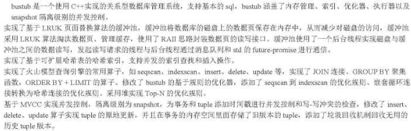

## 专业技能

- 熟练使用C++，熟悉C++的指针、内存管理、封装、继承、多态等，掌握C++11的常用特性
- 掌握基础数据结构和常用算法的基本原理，掌握std标准库中常用数据结构和算法的使用
- 熟悉Linux C++开发，了解GCC、GDB、Makefile等工具
- 熟悉Docker的基本使用，包括构建镜像、运行容器、管理网络等
- 熟悉Git，有项目协作与版本控制经验
- 熟悉关系型数据库，了解SQL语句，了解索引、锁、日志和事务
- 熟悉计算机网络，了解TCP/IP协议、HTTP协议的基本原理

## 项目经历

### CMU15-445 bustub数据库

项目描述：bustub是基于现代 C++ 开发的支持并发操作的关系型数据库，支持基本的sql，bustub涵盖了内存管理、索引、优化器、执行器

- 实现了基于LRU-K页面替换算法的缓冲池，缓冲池将数据库的磁盘上的数据页保存在内存中，减少对磁盘的访问
- 实现了基于可扩展哈希表的哈希索引，支持并发的索引查找和插入操作
- 实现了支持并发操作的B+树，支持索引的查找、插入和删除操作，通过螃蟹锁+乐观锁实现B+树的多线程操作
- 根据火山模型实现查询引擎的常用算子，如seqscan、indexscan、insert、delete、sort等，实现了join连接、groupby聚集函数，orderby+limit的算子；修改了bustub的基于规则的优化器，添加了嵌套循环连接转换为哈希连接的优化规则、采用堆实现 Top-N的优化规则
- 实现了数据库事务的并发控制以及死锁检测，采用一个基于两阶段锁的并发控制方式，自动为并发事务执行加锁解锁，提供可串行化能力并实现可重复读、读已提交、读未提交三种隔离度

### 气象数据中心

项目描述：气象数据中心是把气象系统中全部需要共享的数据统一采集和存储，为信息系统提供数据支撑环境的平台

- 利用linux共享内存和信号量机制实现守护进程和调度程序，监控进程运行状态保持服务程序稳定性
- 数据中心可通过FTP协议、HTTP协议或者直连数据库从不同数据源获取数据进行统一化处理存储到数据库
- 针对MySQL高可用方案的不足，通过Federated存储引擎实现一对多灵活数据同步系统，可从远程数据库中实现数据同步
- 实现对历史数据定期清理或备份迁移的数据管理模块
- 实现数据服务总线模块，业务系统通过总线采用HTTP协议获取数据，通过配置参数，实现不同数据接口；设置访问权限；填写访问日志（接口名、时间、数据量）；
- 采用条件变量加互斥锁（生产者消费者模型）实现处理队列以及线程池方案优化数据总线模块

