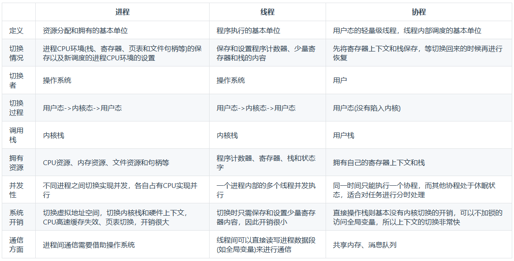

# 进程虚拟内存空间

进程的虚拟内存空间从低地址到高地址一般分为以下几段，每段用于不同的用途：

1. **代码段（Text Segment）**：
   - 包含程序的可执行指令。通常是只读的，以防止程序自身修改指令。
   - 共享的代码段可以被多个进程共享，从而节省内存。
2. **数据段（Data Segment）**：
   - 包含已初始化的全局变量和静态变量。分为：
     - **已初始化数据段（.data）**：存储已初始化的全局变量和静态变量。
     - **未初始化数据段（.bss - Block Started by Symbol）**：存储未初始化的全局变量和静态变量。未初始化数据段在程序启动时会被初始化为0。
3. **堆（Heap）**：
   - 动态内存分配区域，由`malloc`、`calloc`、`realloc`等库函数分配，`free`函数释放。
   - 堆的大小可以在程序运行期间动态调整，通常从低地址向高地址增长。
4. **栈（Stack）**：
   - 存储函数的局部变量、函数参数、返回地址等。由编译器自动管理。
   - 栈通常从高地址向低地址增长。
5. **内核区**：
   - 用户进程无法直接访问，存储操作系统内核的代码和数据。用户进程的虚拟内存空间中也包含映射到内核的地址，但这些地址只能由操作系统访问。

通常内存布局如下：

```
+--------------------+ 0xFFFFFFFF (顶端地址)
|                    |
|    内核空间        |
|                    |
+--------------------+
|                    | 低地址 -> 高地址
|      栈            |
|                    |
+--------------------+
|                    |
|  动态库和内存映射  |
|                    |
+--------------------+
|                    |
|       堆           |
|                    |
+--------------------+
| .bss (未初始化数据)|
+--------------------+
|   .data (已初始化数据) |
+--------------------+
|  .text (代码)      |
+--------------------+ 0x00000000 (底端地址)
```

各段具体的地址范围和大小取决于操作系统、编译器和程序的具体实现。

# 进程和线程、协程



线程（Thread）和进程（Process）是操作系统中管理和调度程序执行的基本单位，它们有以下主要区别：

1. **定义**：
   - **进程**（Process）是程序执行的实例，它包含了程序执行所需的资源（如内存、文件句柄等），是操作系统进行资源分配基本单位。
   - **线程**（Thread）是进程内的一个执行单元，多个线程共享同一个进程的资源，包括内存空间、文件和打开的IO设备等，是调度的基本单位。
2. **资源使用**：
   - **进程**是独立的内存空间和资源分配单元，每个进程有自己的地址空间。
   - **线程**共享所属进程的内存空间和资源，包括代码段、数据段和打开的文件等。
3. **调度和切换**：
   - **进程**是操作系统进行资源分配和调度的基本单位，进程间的切换开销较大，因为切换需要保存和恢复整个进程的上下文信息。
   - **线程**是操作系统进行调度的基本单位，线程的切换开销较小，因为线程共享相同的地址空间，切换只需保存和恢复少量的上下文信息。
4. **通信和同步**：
   - **进程**之间的通信相对复杂，通常需要使用操作系统提供的进程间通信（IPC）机制，如管道、消息队列、共享内存等。
   - **线程**之间共享同一进程的地址空间，因此可以直接共享数据，线程间通信比进程间通信更为高效。
5. **并发性**：
   - **进程**是资源分配的基本单位，每个进程有自己的资源，因此可以并发执行多个进程。
   - **线程**是CPU调度的基本单位，多个线程在同一进程内共享资源，可以并发执行，实现程序内部的并行处理。

总体来说，线程是轻量级的进程，它们可以更有效地利用系统资源，并提供更高效的并发和通信机制。进程则提供了更高的隔离性和安全性，但通常需要更多的系统资源。在实际的软件设计和开发中，可以根据需求选择使用进程或线程来实现不同的功能和性能要求。